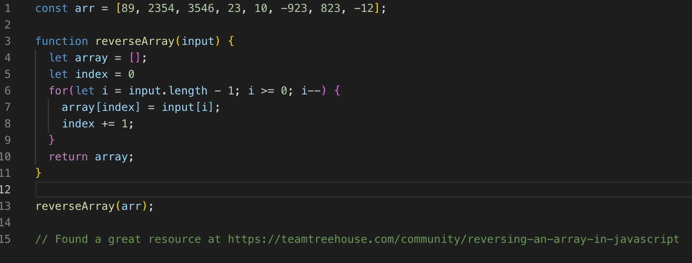

# Table Of Contents

## Reverse an Array
Write a function that reverses an order of any given array of integers. 

### Challenge
Please see "Reverse an Array", and note that we cannot used any built in methods of the JavaScript language (i.e. array.reverse())

### Approach & Efficiency
I knew I wanted to do this using a reverse loop, and pushing those integers to a new array as they were called in the loop. Then, I returned the array and called the function outside of the loop to produce the reversed array. 

### Solution

