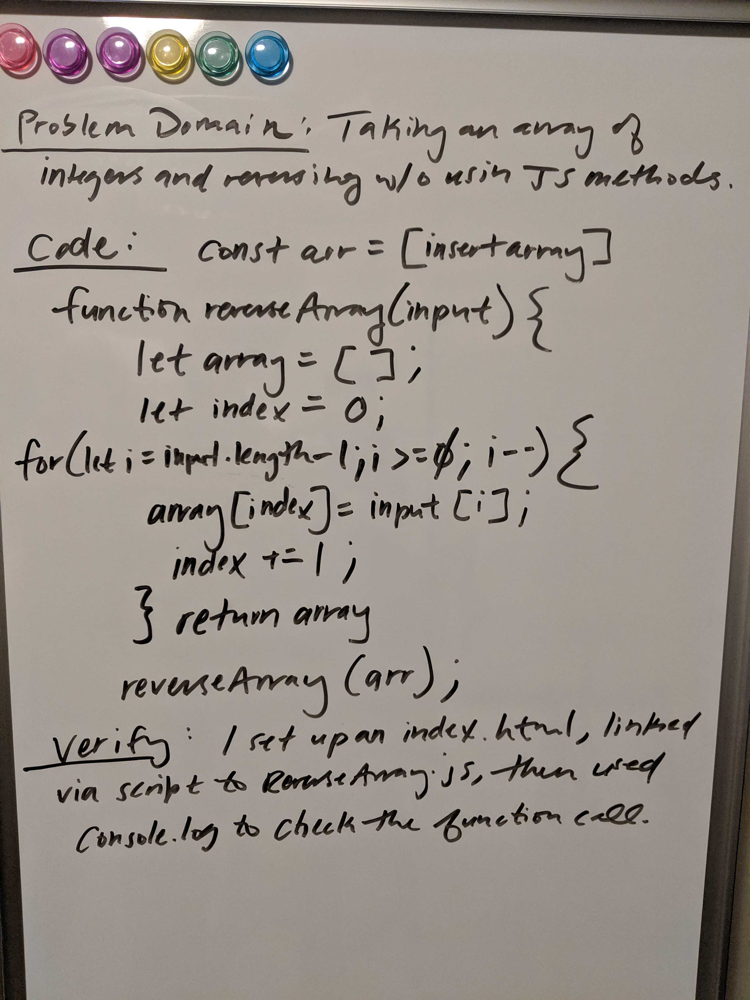
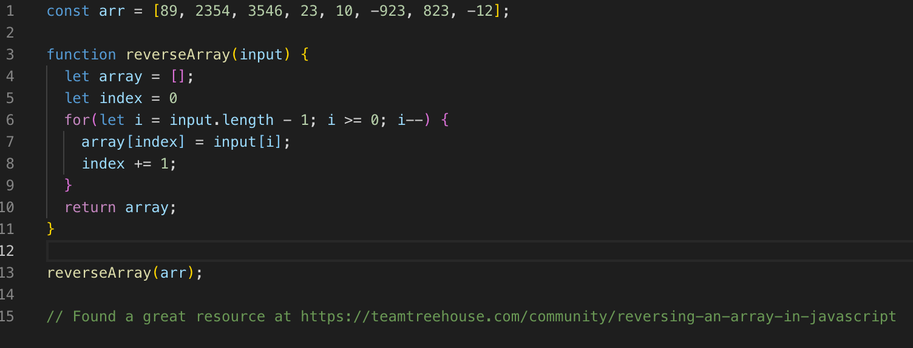

## Code Challenge | Reverse an Array
Write a function that reverses the order of any given array of integers.  

### Challenge
Please see the prior section describing the problem domain, and note that we were not permitted to use any built in methods of the JavaScript language (i.e. array.reverse(), .push, .pop, etc.).

### Approach & Efficiency
I knew I wanted to do this using a reverse loop, but had to figure out a way to do it without using built in JS methods. This proved pretty difficult, but I was able to find some helpful resources online that involve using a counter of sorts, and using a reverse for loop. I was able to get this solution to return the correct answer. 

### Solution

