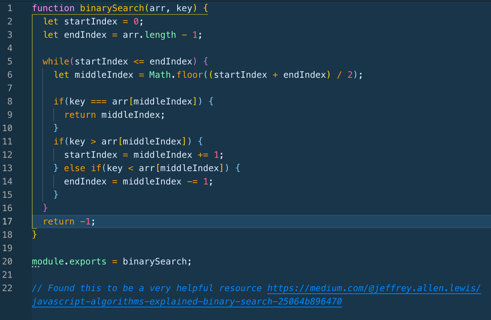

## Code Challenge | Array Binary Search
This challenge asked us to write a function that takes in a sorted array, and a value, tracks down the location of the value, and returns the index position of that value. We were supposed to engage this challenge using a binary sort, which is a specific approach. 

### Challenge Description
Please see above, with the caveat that we were not permitted to use any built-in JS methods for this challenge. 

### Approach & Efficiency
My initial approach (before I knew about how to use the binary sort) was to just create a for loop, iterate through the loop, and if the value was equal to the item in the array, I would return the value of the index! This wasn't quite correct, as I soon found out. I then did a binary sort. This required establishing a variable middle index, a start index, and an end index. Using various JS logic concepts, I was able to solve the challenge with the function. 

### Solution

