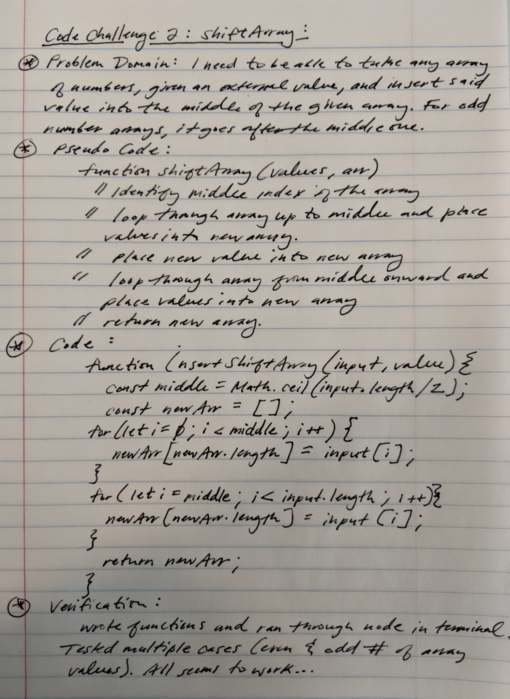
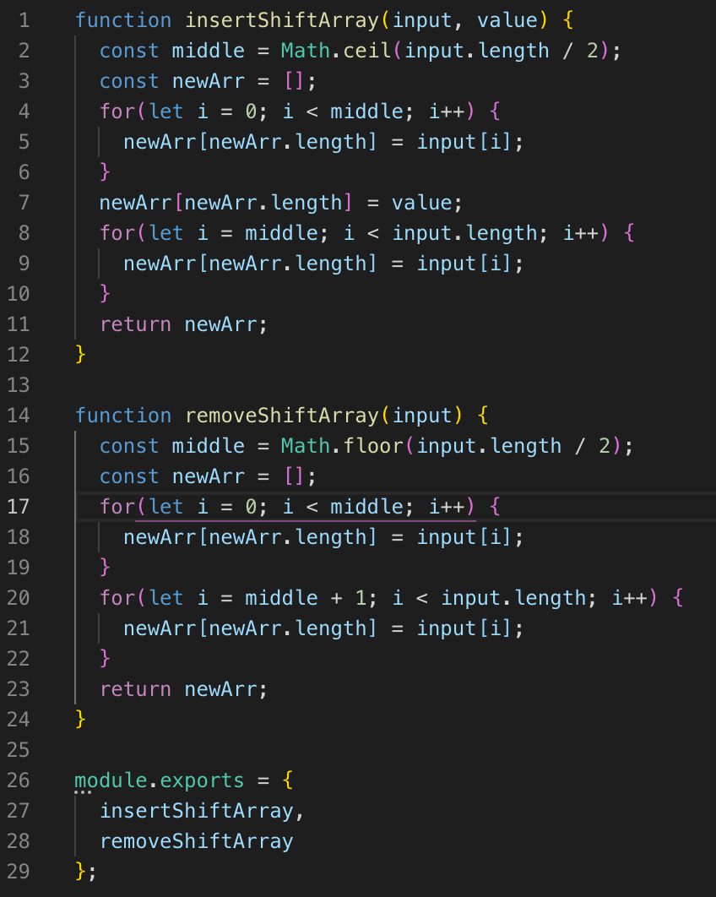

## Code Challenge | Array Shift
We were to write a challenge that took an existing array, took an external value, and inserted that external value to the middle of the given array. For arrays with odd numbers, with no true middle, it was placed after the middle element of the array. 

### Challenge Description
See above section, and note that we were not permitted to use any built in JavaScript methods. 

### Approach & Efficiency
I took several approaches to this code challenge, none of which worked until my last approach. I broke the array into two for loops. The first for loop iterated up to the middle value, and I calculated middle using Math.cel(array.length / 2). I then pushed those values into a new array (not using the .push method!), then added the middle value to the array, then did another for loop. This last for loop went from middle up to the length of the array, and pushed those values into the same array. I then returned that array. 

### Solution

