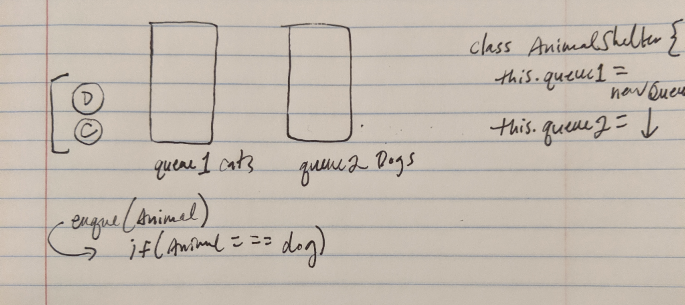

## Code Challenge | Animal Shelter
The point of this was to determine of the animal type given in the method was a cat or a dog, and correspondingly adding that animal, based on type, to a dog or cat queue instantiated using the Animal Shelter class. 

### Challenge Description
Please see above for code challenge description.

### Approach & Efficiency
This was really similar to some of the other stuff, so I just looked at it. 

### Solution

