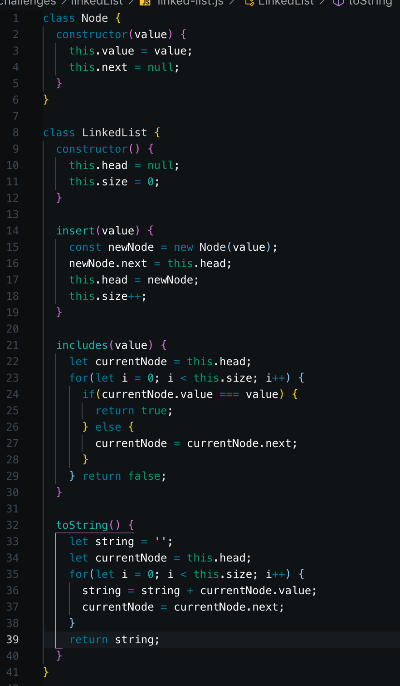

## Code Challenge | Linked Lists
Create a linked list, and then add three methods 1) .insert(), 2), includes(), and string(). Then using these three methods, pass a series of tests, showcasing that the written methods and logic are successful. Do another three functions 1) append, 2) insertBefore, and 3) insertAfter. 

### Challenge Description
Please see above for code challenge description. This is a combo of two code challenges. 

### Approach & Efficiency
My approach to this was really to do some heavy research before beginning, understanding further what linked lists are, how they behave, and more importantly, how to build one. Further, how to test it. I kind of fumbled my way through writing the methods attached to the new class of Linked List, which was calling new Node. Through these methods, I was able to successfully build a linked list, which I could then test in my Jest testing suite. I built a large number of tests (20?) to pass all 8 conditions as proposed in the coding challenge. This took quite a bit longer, as I needed to make some tweaks, and just needed to figure out how to work the testing program (still figuring out Jest!).

### Solution

