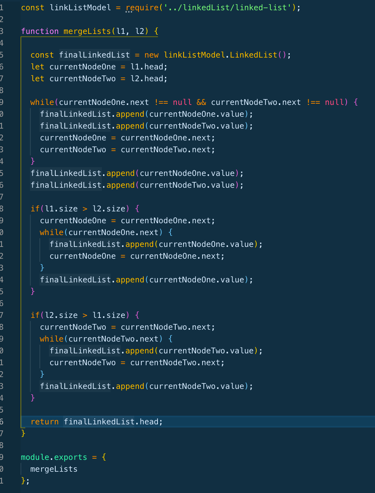

## Code Challenge | Zipper Merge
Continuing with Linked Lists, this challenge was designed to test out ability to merge (in a zipper fashion), two Linked Lists together. That is, taking list 1 and list 2, and generating each list's value one after another, as a zipper. 

### Challenge Description
Please see above for code challenge description.

### Approach & Efficiency
I knew we needed two linked lists, each with then leveraged our insert and append methods stored in linked-list.js. We could then set up a while loop checking to see if the next value for each current node (one for list1 and another for list2) was null. As long as it wasn't null, we would append the current node's value (for both lists), and then current nodes become currentnode.next. At the end of the list, you append the final current nodes values, and as requested in the instructions, return the final linked list's head. 

### Solution

