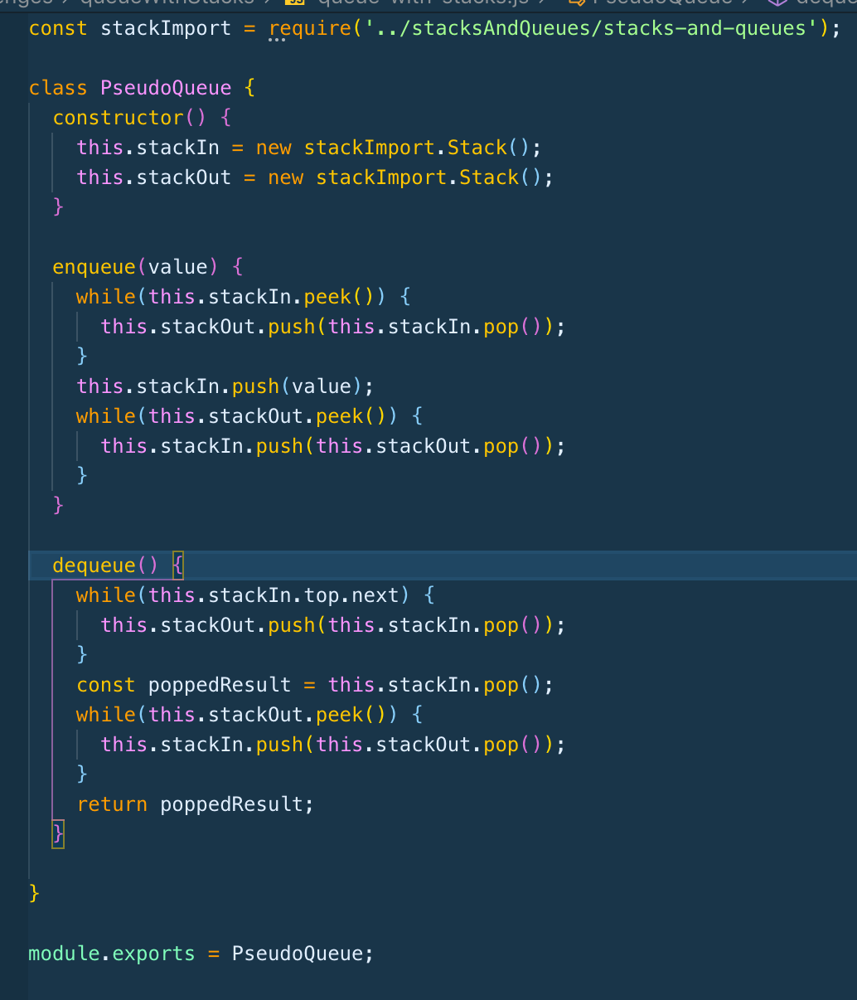
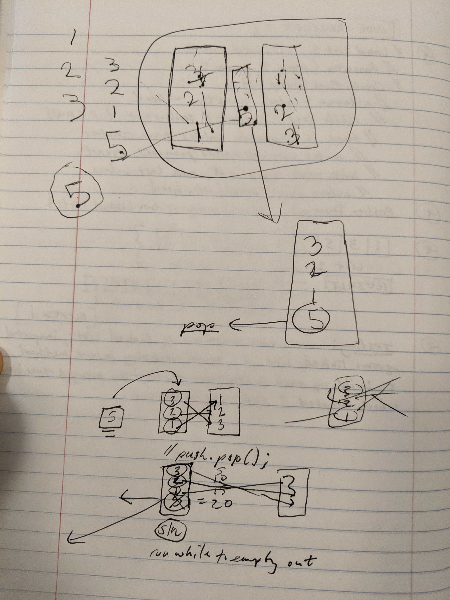

## Code Challenge | Queues with Stacks

### Challenge Description
For this code challenge, you build a queue that includes two stacks. Stack in, stack out, and then you take a value, and push that into the stack. So the result being that you take in values, push them over to the second stack, insert a new value into the stack in, then push everything in the second stack back to the first stack.  

### Approach & Efficiency
My approach was to whiteboard, visualize, and ask for help when needed. 

### Solution

